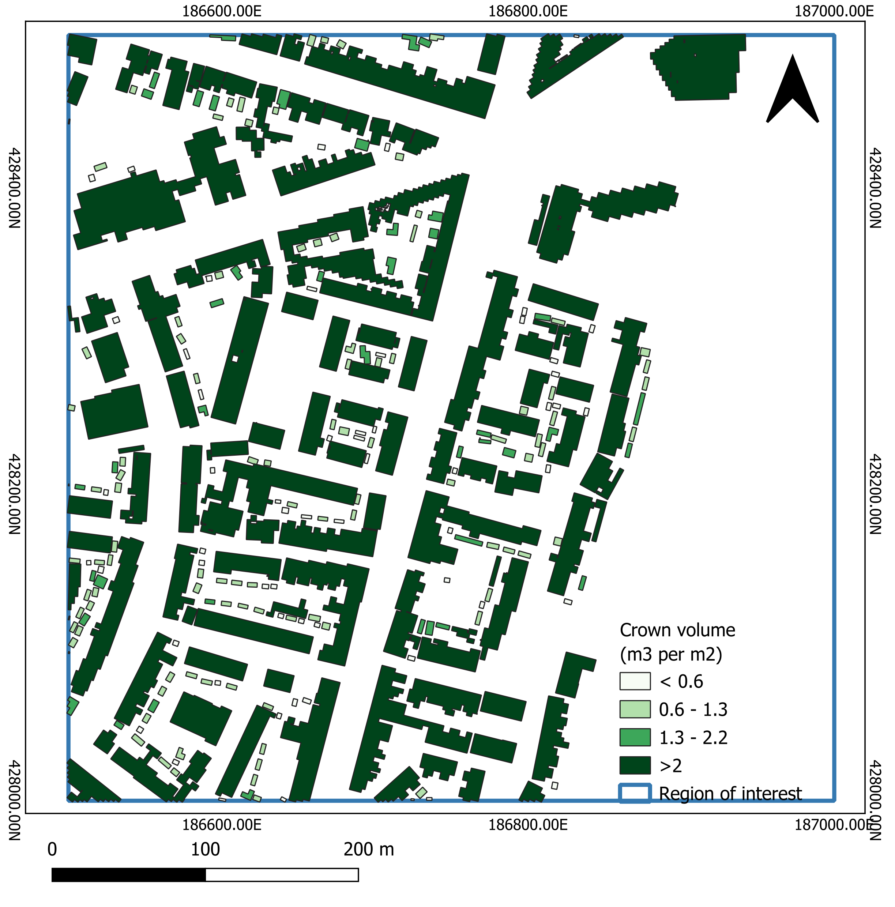

This repository contains a pipeline for analyzing tree crown metrics and generating 3D visualizations from LiDAR data, demonstrated on [AHN4](https://www.ahn.nl/) Dutch elevation data. The workflow includes point cloud processing, classification, and geometric analysis of tree structures.

## 📌 Pipeline Overview

The pipeline consists of six main steps (see [`notebooks/3d_tree_crown.ipynb`](./notebooks/3d_tree_crown.ipynb)):

1. **Data Loading**: Read and process LAS point cloud files.
2. **Classification**: Separate ground and vegetation points using AHN4 classification labels.
3. **Filtering**: Remove outliers using Z-score statistical analysis.
4. **DEM Generation**: Create Digital Elevation Models using Kriging interpolation.
5. **3D Visualization**: Interactive point cloud visualization with Open3D.
6. **Metric Extraction**: Calculate tree height, diameter, and crown volume.

---

## 📷 Example Visualizations

|  |  |
|:---:|:---:|
| Raw LiDAR Point Cloud | Classified Ground & Vegetation |

|  |  |
|:---:|:---:|
| Digital Elevation Model | 3D Crown Metrics Visualization |

---

## 📂 Folder Structure

```
3d-tree-crown-analysis/
├── notebooks/
│   └── 3d_tree_crown.ipynb   # Main analysis notebook
├── data/
│   └── AHN4/                 # LiDAR data (LAS format)
├── src/
│   └── pointcloud_utils.py    # Helper functions
├── assets/
│   └── screenshots/           # Visualization examples
├── environment.yml            # Conda environment setup
└── README.md                  # Project documentation
```

---

## 🚀 Usage

1. **Download AHN4 data** from [geotiles.nl](http://geotiles.nl) and place it in `data/AHN4/`.
2. **For Kavel10 data:**
   - Contact: [richard@kavel10.nl](mailto:richard@kavel10.nl)
   - Website: [Kavel10 LiDAR](https://kavel10.nl/producten/lidar-airborne/)
3. **Run the following script to load and process the LiDAR data:**

```python
import os
import laspy

os.chdir('./data/AHN4')  # Update to relative path
las = laspy.read("class2.las")
```

---

# 🌲 LiDAR Processing Pipeline

## 🔹 Key Features

### 📌 Point Cloud Processing
- LAS file loading and attribute extraction.
- Z-score based outlier removal.
- Ground/vegetation classification.

### 📌 Spatial Analysis
- Kriging interpolation for DEM generation.
- Elevation normalization.

### 📌 3D Visualization
- Interactive Open3D visualizations.
- Custom color mapping for classifications.

### 📌 Metric Extraction
- Tree height calculation.
- Crown diameter estimation.
- Volume approximation.

---

## ⚡ Performance

The pipeline efficiently processes standard AHN4 tiles (500m x 500m) in **5-8 minutes** on moderate hardware. Typical results include:

- **200-500 trees detected per tile**.
- **Height estimation accuracy:** ±0.5m.
- **Diameter estimation consistency:** 85% within a 10% error margin.

---

## 🤝 Contributing

Contributions are welcome! To contribute:

1. Open an **issue** to discuss proposed changes.
2. Create a **feature branch** for development.
3. Submit a **pull request** with test cases.

---

## 🎓 Acknowledgements

Developed for **LiDAR analysis research** using open **AHN4 data** from the Dutch government. This project incorporates components from:

- **PyKrige** for spatial interpolation.
- **Open3D** for 3D visualization.
- **LasPy** for LAS file processing.

---

## 📜 License

This project is licensed under the **European Union Public License 1.2 (EUPL-1.2)**.
