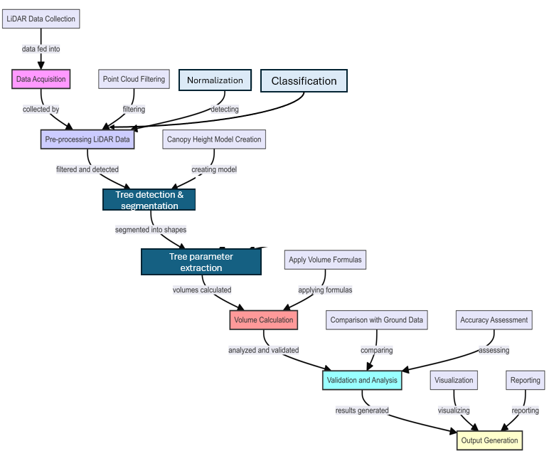
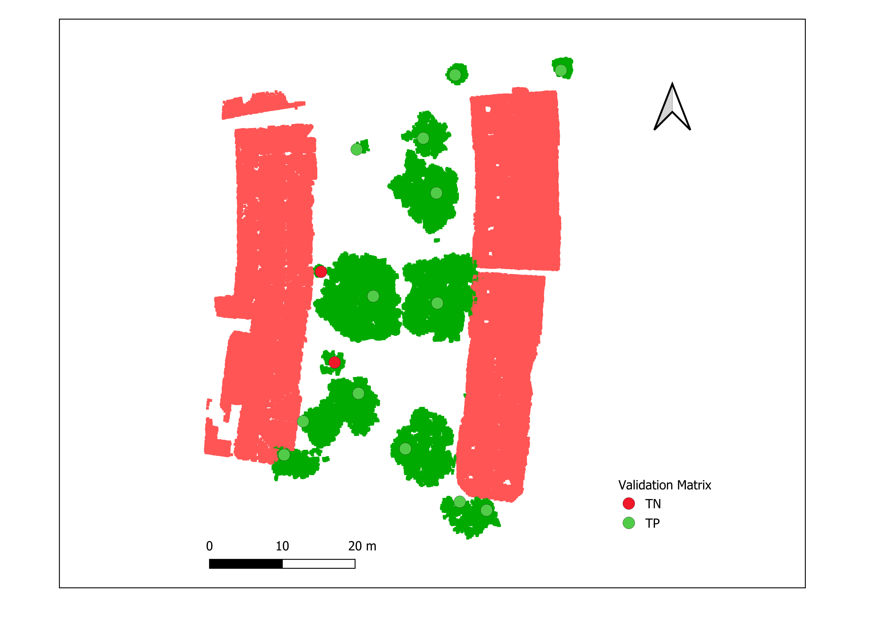
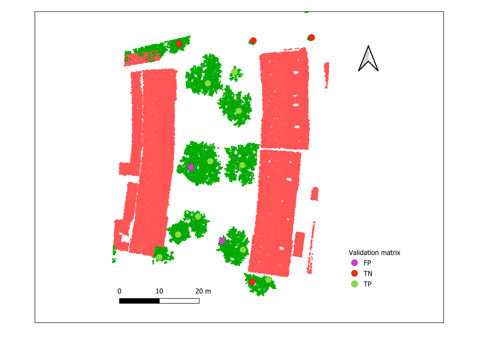

This repository contains a pipeline for analyzing tree crown metrics and generating 3D visualizations from LiDAR data, demonstrated on [AHN4](https://www.ahn.nl/) Dutch elevation data. The workflow includes point cloud processing, classification, and geometric analysis of tree structures.

## 📌 Pipeline Overview

The pipeline consists of six main steps (see [`notebooks/3d_tree_crown.ipynb`](3D_tree_crown_modelling.ipynb)):

1. **Data Loading**: Read and process LAS point cloud files.
2. **Classification**: Separate ground and vegetation points using AHN4 classification labels.
3. **Filtering**: Remove outliers using Z-score statistical analysis.
4. **DEM Generation**: Create Digital Elevation Models using Kriging interpolation.
5. **3D Visualization**: Interactive point cloud visualization with Open3D.
6. **Metric Extraction**: Calculate tree height, diameter, and crown volume.

---

## 📷 Example Visualizations

|  |  |
|:---:|:---:|
| Methodolody | Tree detected using Commercial data |

|  |  |
|:---:|:---:|
| Tree detected using open source data(sample | 3D Crown Metrics Visualization |

---

## 📂 Folder Structure

```
3d-tree-crown-analysis/
├── notebooks/
│   └── 3d_tree_crown.ipynb   # Main analysis notebook
├── data/
│   └── AHN4/                 # LiDAR data (LAS format)
├── src/
│   └── pointcloud_utils.py    # Helper functions
├── assets/
│   └── screenshots/           # Visualization examples
├── environment.yml            # Conda environment setup
└── README.md                  # Project documentation
```

---

## 🚀 Usage

1. **Download AHN4 data** from [geotiles.nl](http://geotiles.nl) and place it in `data/AHN4/`.
2. **For Kavel10 data:**
   - Contact: [richard@kavel10.nl](mailto:richard@kavel10.nl)
   - Website: [Kavel10 LiDAR](https://kavel10.nl/producten/lidar-airborne/)
3. **Run the following script to load and process the LiDAR data:**

```python
import os
import laspy

os.chdir('./data/AHN4')  # Update to relative path
las = laspy.read("class2.las")
```

---

# 🌲 Tree crown volume estimation Pipeline

## 🔹 Key Features

### Filtering Ground Points:
Filters ground points by selecting classification **class 2** from the LiDAR point cloud.

### 3D Tree Detection & Processing:
- Uses **KDTree** and **ConvexHull** algorithms from Scipy for tree segmentation and geometric calculations.
- Utilizes `griddata()` and `UnivariateSpline()` for surface interpolation.

### Point Cloud Classification & Trunk Extraction:
- Applies statistical methods like **z-score normalization** to refine point classifications.
- Uses custom utilities (`trunk_utils`) for extracting and analyzing tree trunks.

### Geospatial Analysis:
- Uses **Geopandas** and **Shapely** to generate polygonal tree crown representations.


---

## Performance Metrics 🚀

| **Dataset**  | **Precision** | **Recall** | **F1 Score** |
|-------------|-------------|-----------|------------|
| **AHN4**   | 0.83        | 0.67      | 0.74       |
| **Kavel10** | 1.00        | 0.87      | 0.93       |

🔹 **Kavel10 dataset outperformed AHN4**, achieving **higher accuracy and recall** in tree detection.  
🔹 **Crown volume estimation RMSE**:  

- **AHN4**: 16.94 m³  
- **Kavel10**: 12.31 m³ (More accurate)  

---

## **Key Findings & Challenges**

✅ **LiDAR-based 3D modelling effectively estimates tree crown volumes.**  
✅ **AHN4 is freely available but has lower accuracy due to misclassification.**  
✅ **Kavel10 has higher accuracy but is expensive and requires intensive reclassification.**  
⚠️ **Limited validation data—small subset used for testing.**  
⚠️ **High computational cost for large-scale processing.**  


---

## 🤝 Contributing

Contributions are welcome! To contribute:

1. Open an **issue** to discuss proposed changes.
2. Create a **feature branch** for development.
3. Submit a **pull request** with test cases.

---

## 🎓 Acknowledgements

Developed for **LiDAR analysis research** using open **AHN4 data** from the Dutch government. This project incorporates components from:

- **PyKrige** for spatial interpolation.
- **Open3D** for 3D visualization.
- **LasPy** for LAS file processing.
- **[Utils](https://amsterdamintelligence.com/)** for tree detection, developed by Amsterdam Intelligence.

---

